# 🌙 番外织梦阁 · SPINOFF WEAVER

* 脚本编写、教程作者：Gloria
* 本作品发布在Discord社区：旅程、尾巴镇、喵喵电波
* 脚本若有问题，可以随时在社区问我
* 最新版本：V1.2.0
* 更新时间：2026/04/30
* 获取方式：社区获取 / github获取

---

# 📑 目录

* [🗝️ 功能简介](#-功能简介)
* [🚀 安装与使用教程](#-安装与使用教程)
* [🧠 生成器与提示词解析](#-生成器与提示词解析)
* [❓ 常见问题](#-常见问题)
* [📝 更新日志](#-更新日志)
* [🧭 全系列导航](#-全系列导航)——剧情推进三部曲

---

# 🗝️ 功能简介

* 这是**同系列第三作**，也是目前自由度最高的剧情生成工具。

* 和前两作不同，织梦阁不针对特定类型（副本/案件），而是面向**一切可能的番外剧情空间**——平行时空、机制碰撞、穿越快穿、连载宇宙。
* 可以看作是生成一个你和角色的DLC单元剧情线，或者把之前固定好的“小剧场”拓展成可以自由RP的“大剧场”。

* 生成的不是一段死板文字，而是一份完整的**舞台搭建指南**，包含大纲、事件池、多维走向，供你自由 RP 落地。

**用于：**
* 平行时空 RP（ABO / 哨向 / 赛博朋克 / 修仙……任何世界观切换）
* 深度机制碰撞（花吐症 / 时间循环 / 身体互换 / 变小动物……）
* 穿越 / 快穿 / 回溯支线
* 跨番外联动的连载级"番外宇宙"

**生成内容包括但不限于：**
* 情境快照（初始感官冲击 + 角色待机状态）
* 动态事件池（灵感触发 + 走向爆点）
* 多维走向引擎（解谜探索 / 权谋争夺 / 情感联结 / 成长蜕变）
* 可选任务系统（含奖惩机制与系统吐槽）
* 世界书内置状态栏（需配置相关正则）
* 联动继承（从上一番外读取未解伏笔 / 关系变动 / 关键信物）


---

# 🚀 安装与使用教程

---

## 1 安装脚本

* 非常正常的导入操作：
* 下载 JSON 文件
* 打开酒馆助手
* 导入脚本
<p align="center">
  
</p>
启用：「左下角的魔法棒 → 番外织梦阁」
<p align="center">
  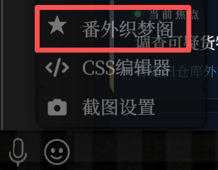
</p>

### 其他内容
* 如果想要大纲对应的COT和状态栏美化，请前往“others”文件夹获取~

---

## 2 前期配置

### 主题

* 多套视觉主题可选，各有对应小彩蛋，按喜好选择即可
* 此处我必须炫耀一下敲可耐的小狐狸（我们的系统大人）！日间/夜间表情不同哦~
<p align="center">
  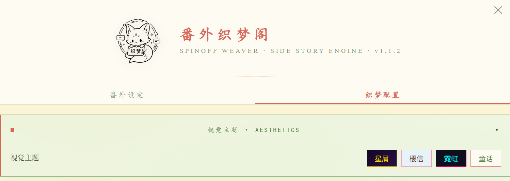
</p>

### API 配置
（偷一下之前的图）
* 标准配置：API URL / API Key / Model
* **强烈建议使用 gemini 2.5 pro**，本次提示词结构复杂、token 较多，不建议使用 flash 系列模型（详见常见问题）
<p align="center">
  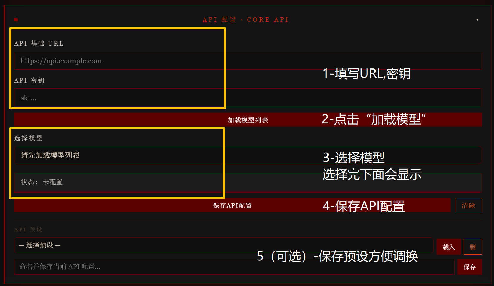
</p>


### 提示词设置

* 支持修改和保存预设
* 默认 Prompt 已针对番外生成场景优化，**新手建议直接使用默认，不做任何修改**
* 若有修改需求，请先阅读下方"提示词解析"章节

### 破限词设置
* 破限词注入在提示词前，防止截断。
* 如果你的输入包含限制级内容，或者想要大纲中开启“NSFW模式”，请在"核心设置 → NSFW 设置"中：
  1. 将 NSFW 开关切换为"开启"
  2. **在破限词栏填入你所使用角色卡 / 模型对应的破限词**
  3. 破限词留空时，即使开启开关，NSFW 内容也不会生效
* 破限词因角色卡和模型不同而不同，请自行找有关破限填入（可以自行从预设里面扒）
<p align="center">
  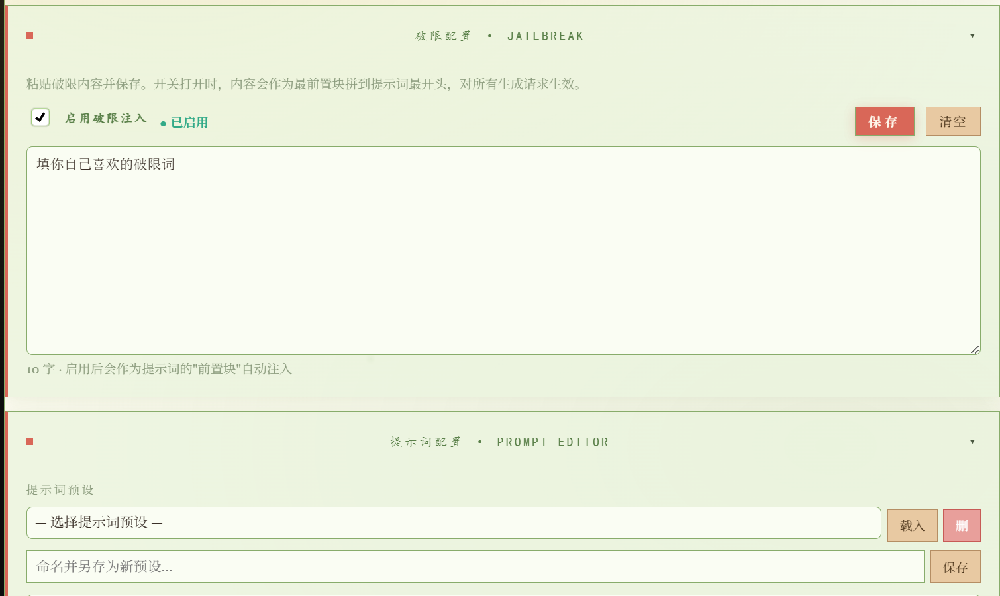
</p>

---

## 3 生成器配置

### 选项库说明

本次生成器选项库**体量较大**，为避免选择困难，做了大类分类：

* **时代背景**
* 选择【新设定·当前时间线】【非当前·全新】，【抽选】或【固定】会显示：东方古典/西方古典/近代与民国/现代都市/超自然/异能/知名IP/科幻/未来/末日/生存/特殊体系/元叙事/游戏化/回忆平行

* **选项**
* 随机-从全部库随机抽取
* 抽取-可从库中选择若干条，在从选择的内容中抽取（开启选择库）
选择库每个大类可展开具体选择，也可以直接点击大类，默认选择内部全部选项
* 固定-可从库中选择若干条，默认为设定条目
* 自定义：可手动输入想要的设定内容

<p align="center">
  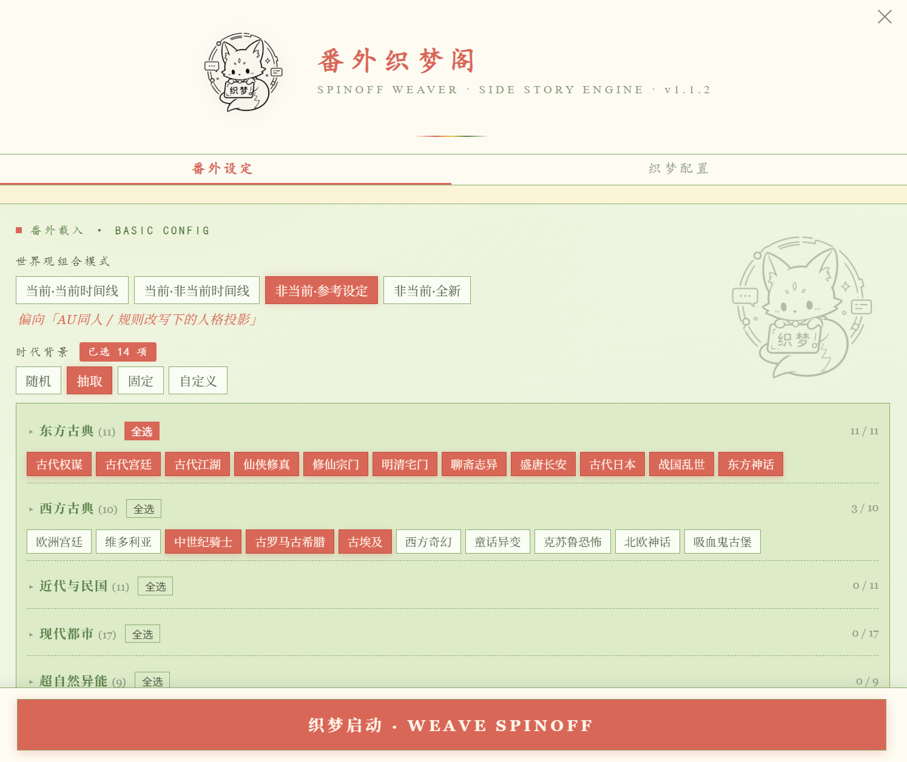
</p>

* **灵感池**
* 选择【是】：体型 · 物种变化/身份 · 身体互换/身体异常 · 诅咒/记忆 · 认知/感知 · 超能力/契约 · 强制绑定/时间 · 循环/穿越 · 元叙事/关系 · 狗血/情境 · 处境类/NSFW灵感
* 选择方法同【时代背景】

<p align="center">
  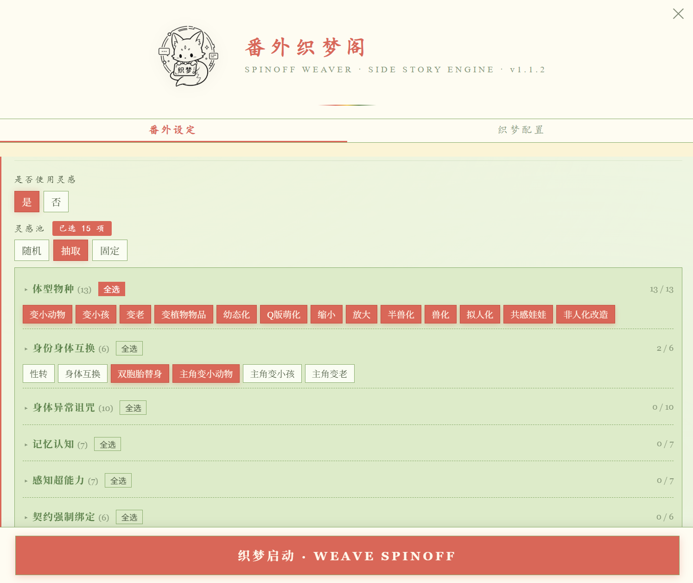
</p>

* **风格**：选择方法类同，但没有大类了

<p align="center">
  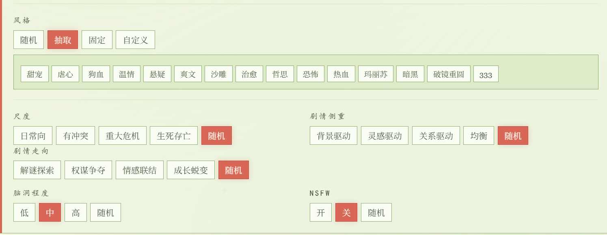
</p>

其他内容正常选择即可，但这次可选条目过多，简单介绍一下：
* 尺度：决定故事“能走多大冲突”（日常 / 有冲突 / 生死级别）
* 剧情侧重：决定“重点写啥”（写世界 / 写机制 / 写关系）
* 剧情走向：决定“故事怎么推进”（解谜 / 争夺 / 恋爱 / 成长）
* 脑洞程度：决定“离不离谱”（现实 → 稍奇幻 → 完全放飞）
* NSFW：懂得都懂哈
* 系统/任务：懂得都懂，快穿文怎么能没有一个嘴贱的系统呢

* 如果你还是不懂如何选择选项，请看【生成器与提示词解析-MODULE 3】内容，宝宝教程教会你大纲是如何构建的

### 选项库配置
* 选项库支持配置按钮，但需要前往设置界面配置。
* 选择【时代背景】【灵感池】【风格】，支持单条或批量导入
<p align="center">
  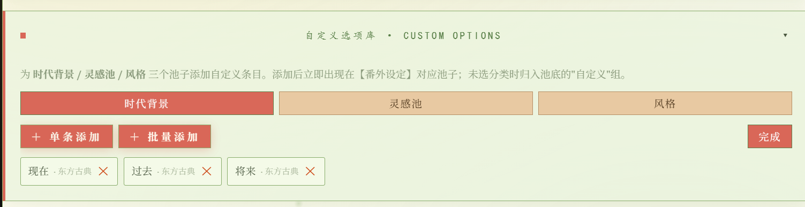
</p>
批量导入换行导入即可，导入的时候可以选择大类，不选择则出现在“自定义”分类中
<p align="center">
  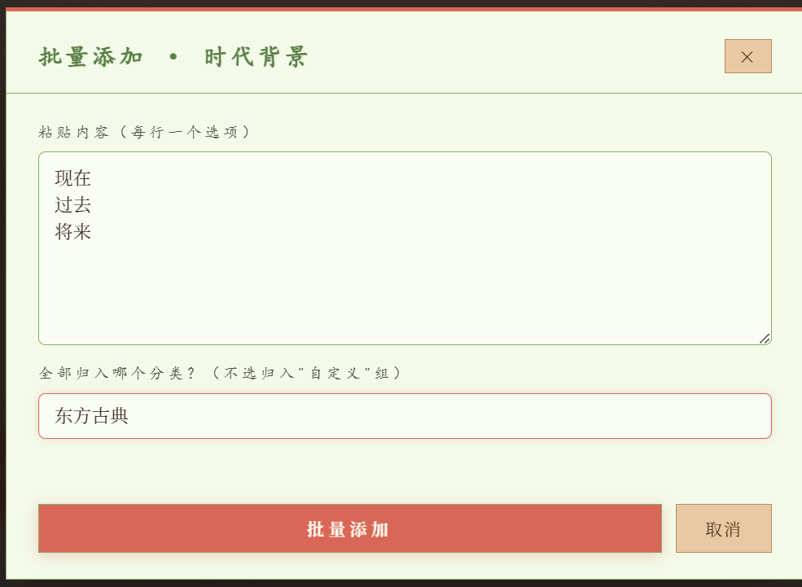
</p>

---

### 背景配置

* 请首先前往设置配置背景信息：
* **人设库**上传{{user}}和主要角色的全部信息（主线剧情身份即可）：
* **大总结**为当你想把你的主线剧情输入时可配置：
<p align="center">
  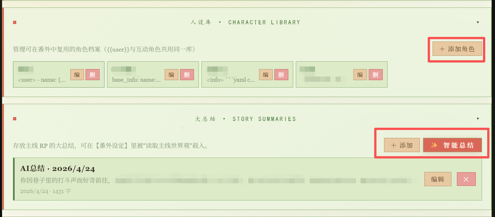
</p>

大总结配置教程：
* 如果有总结好的内容，直接导入即可。若想用ai智能总结：
* 1. 配置API（从设置保存的API预设选择）
* 2. 导入全部剧情
* 这里非常灵活：可以上传任何形式的文件（黑科技等json可上传）、可以粘贴主线剧情，也可以一键导入当前聊天全部内容（支持<>内识别）
* 3. 填写你的要求（主要是如何区分粒度等），聪明的ai会帮你生成大总结的！
* 4. 记得保存（不多说了）

<p align="center">
  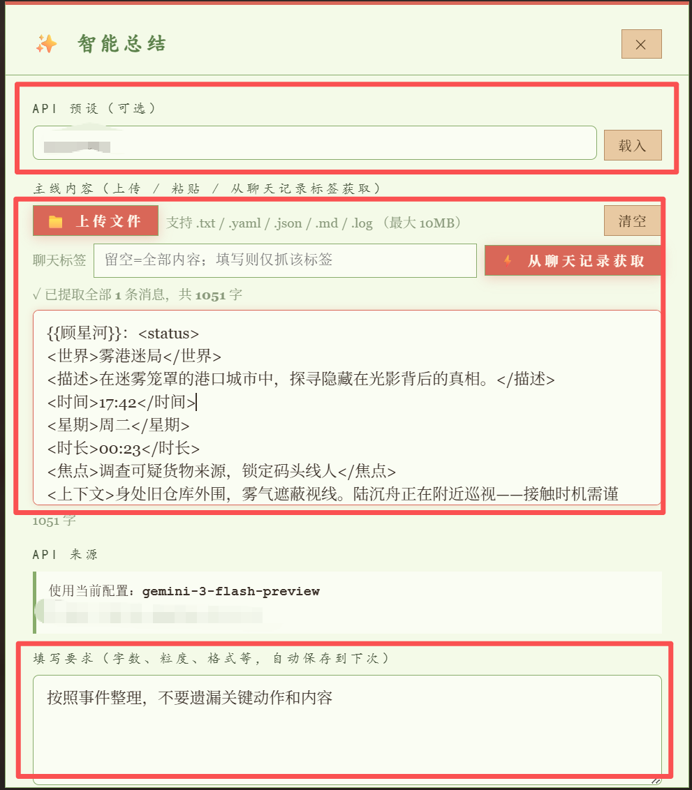
</p>

### 背景选项

* 接下来我们回来选择背景信息，包括：
* 身份挂载：挂上你填好的角色，可选择你希望他在新世界的身份、记忆
<p align="center">
  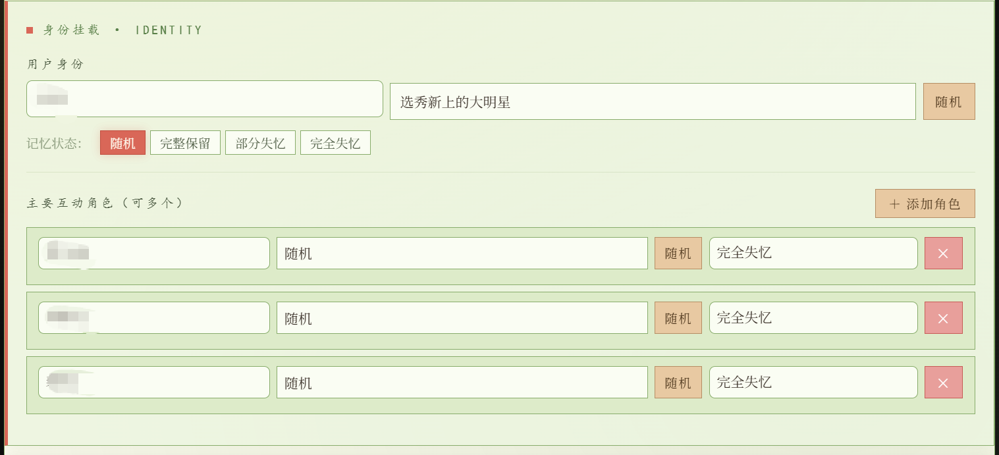
</p>
* 联动模式：开启后需要**从世界书载入既有番外大纲**作为嵌套上下文（也可以手动粘贴），AI会基于这些既有案件生成联动番外。
* 联动模式
* 读取主线：选择"是"后，将自动读取并分析最近的聊天记录，提取当前主线的关键信息（人物关系、重要事件、未解悬念），作为番外创作的隐性背景。
* 开启【主线世界观和设定】：
* 世界书注入：选择"是"后，自动读取当前角色卡下的世界书条目，可指定挂载对应条目（用于让番外贴合已有世界观）
* 导入大总结：配置好的大总结导进去
<p align="center">
  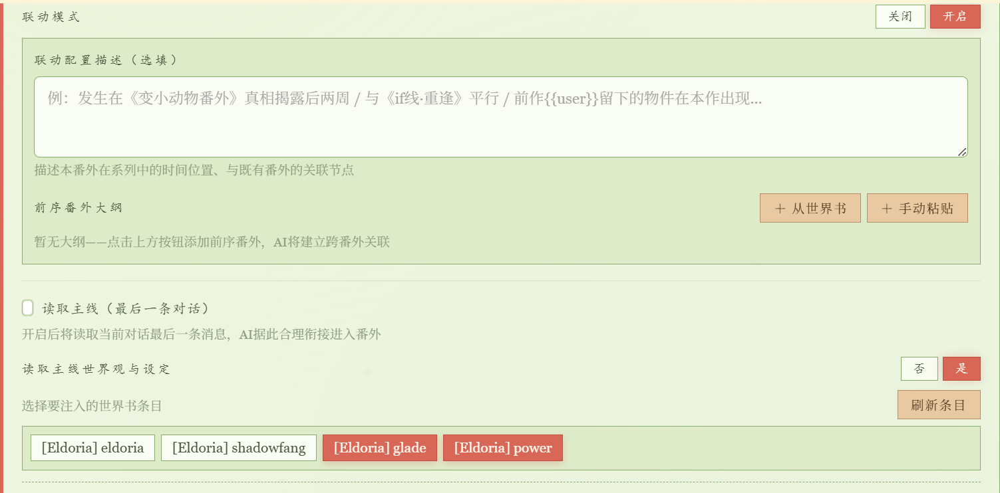
</p>

### 配置完成后，点击「织梦启动 · WEAVE」

---

## 4 生成番外

* 点击启动后弹出确认界面，展示当前注入内容和预估 tokens
* 如想检查注入内容是否完整，点击红色区域展开查看（可复制）
* 生成逻辑：
  * `<spinoff>`：完整番外大纲（含情境快照 / 事件池 / 走向 / 任务系统 / 联动章节）
  * `<spinoff_info>`：摘要（番外名称 / 世界观 / 机制 / 走向引擎 / 规模 / 联动状态）
* 如生成失败（标签包裹错误），可选择重新 roll，或手动确认内容后直接导入（摘要不进世界书，无伤大雅）
<p align="center">
  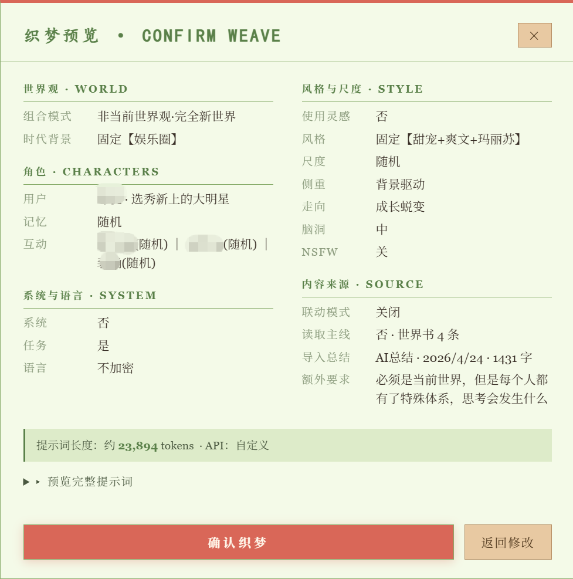
</p>

* 对内容满意后，点击「注入世界书」，自动创建或更新世界书
<p align="center">
  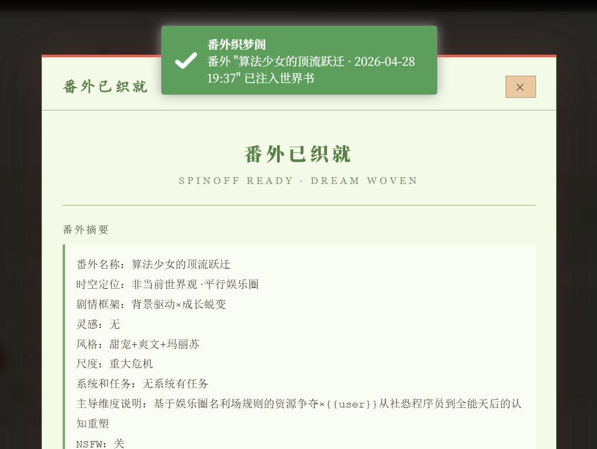
</p>

* 世界书名：**_我的番外宇宙**
* 番外大纲以"**番外名 · 时间**"归档，支持多番外累积
* 同样内置前后包裹条目，防止 AI 被提前剧透
* 世界书条目如下：
<p align="center">
  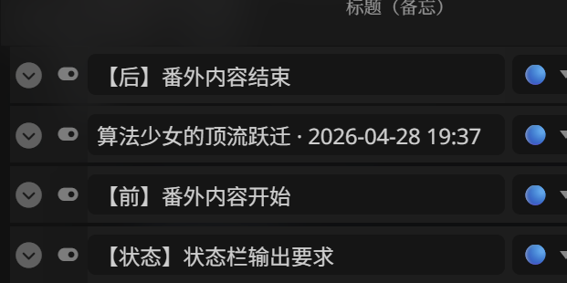
</p>

---

## 5 内置状态栏（双端/双色适配）

* **_我的番外宇宙**世界书内置了一套**动态状态栏系统**，以世界书条目的形式存在，首次注入番外大纲时会自动一并创建（如果没有创建，设置最后的按钮点一点）。
* 如果不需要该状态栏，世界书条目关掉，也可以随意设置深度（可以设置成D0）
* 番外包含：番外信息、User 状态、角色状态、任务框架、系统指引
* 最开始收起，点击可展开
* 状态栏依赖**正则**，请下载对应正则并配置：番外状态栏-织梦系统.json
* 系统超级可爱捏，点击可循环切换多套头像风格
* 目前版本状态栏可能偶发卡顿 bug，后续版本会持续修（大概）
* 简单展示一下吧~
<p align="center">
  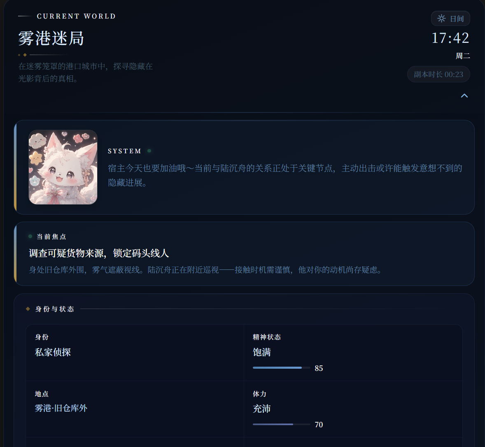
</p>
<p align="center">
  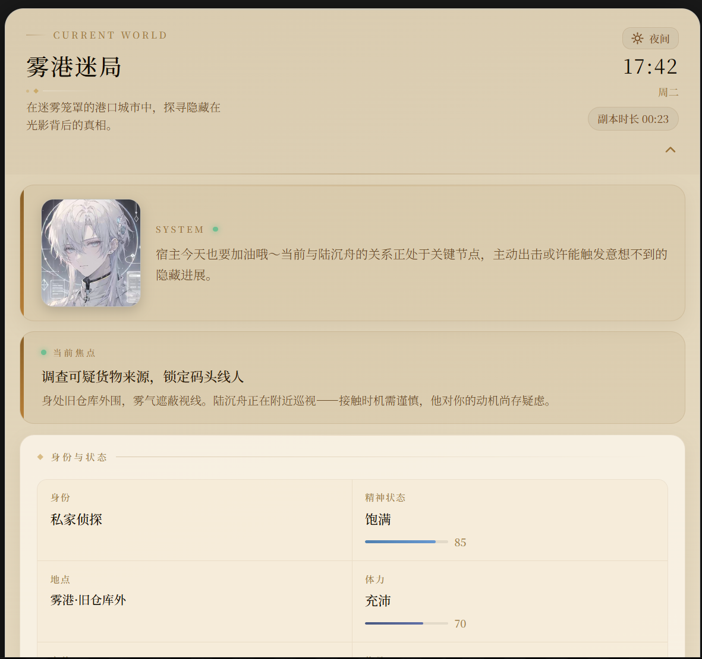
</p>

---

## 5 预设导入 / 导出

* 在"核心设置"最下面
* 导入有防覆盖保护，可放心导入他人预设
* 支持的预设类型：生成器配置预设（配套导入角色/大总结剧情） / 提示词预设

---

# 🧠 生成器与提示词解析

---

* 本章节属于进阶教程，适合想要修改提示词或深度定制生成内容的用户。
* 但因为这个工具个人认为条目比较复杂，并且没什么很强的针对性，大概不太需要修改。

* 生成器由五个模块构成，模块间强相关，修改时需联动检查：

```
MODULE 0（参数注入，你填的配置）
MODULE 1（参考框架库，番外世界观素材池）
MODULE 2（参数引导手册，框架构建逻辑）
MODULE 3（主体框架生成指令，看到的番外大纲）
MODULE 4（输出约束，<spinoff> 包裹规则）
```

---

## Prompt 架构总览

整个生成器的 Prompt 被拆成 5 个模块：

```
MODULE 0：参数注入（你填的全部配置）
MODULE 1：参考框架库（背景库 / 灵感池 / 风格库 / 系统库 / 互动角色库）
MODULE 2：参数引导手册（框架构建逻辑 / 各参数如何影响输出）
MODULE 3：主体框架生成指令（番外大纲模板）
MODULE 4：输出约束（<spinoff> / <spinoff_info> 包裹规则）
```

---

## MODULE 0 · 参数输入（不要改！）

这是生成器 UI 的内容注入位置：

```
{{MODULE_0_BLOCK}}
```

包含：
- 世界观 / 时间线组合 / 时代背景
- 灵感池 / 剧情侧重 / 剧情走向
- 风格 / 尺度 / 脑洞程度 / NSFW
- 是否有系统 / 是否有任务
- 主要互动角色 / 联动模式 / 前序番外信息
- 读取设定开关 / 输出语言

**因为这里是全部输入内容，你不需要修改这里。**

---

## MODULE 1 · 参考框架库（可调整）

这一块是**整个生成器的"番外世界观素材库"**，生成器会从这里抽取风格参照、背景设定和机制原型。

包含：
- **参考作品系谱**：快穿流 / 时空穿越 / 单元剧 / 系统文等各流派代表作，用于内化风格，不直接引用
- **背景库**：近40种时代×世界观组合，每类附可剧情化关键词（如"港风黑帮"对应"堂口规矩 / 双花红棍 / 义气扛刀"）
- **灵感池**：按机制类型分组的番外变量库（体型变化 / 身份互换 / 记忆异常 / 感知超能 / 强制绑定 / 时间循环 / 穿越元叙事 / 关系狗血 / 情境处境 / NSFW灵感）
- **风格基调库**：14种风格及其核心情绪、节奏特征与结局倾向
- **尺度层级库**：4级冲突强度的危机类型与情绪波动说明
- **系统风格库**：甜萌 / 毒舌 / 高冷 / 中二 / 迷糊 / 老好人 / 商人 / 隐身，各有交互特征
- **互动角色库**：按权力差 / 对立冲突 / 情感联结 / 契约绑定 / 身份错位 / 家族血缘 / 特殊功能等维度分类的角色原型，每类附核心张力与典型形态
- **开场机制库 / 退出机制库**：{{user}} 进入和离开番外的触发方式

可按照喜好修改：
- 想加新的番外背景 → 改**背景库**，注意附可剧情化关键词
- 想加新的灵感机制 → 改**灵感池**，注意标注核心张力和氛围关键词
- 想加新的系统风格 → 改**系统风格库**，注意说明互动方式和语言风格示例
- 想加新的角色原型 → 改**互动角色库**，注意标注功能定位

**修改建议：素材库是 AI 内化参考用的，扩充比替换更安全。**

---

## MODULE 2 · 参数引导手册（最核心的部分）

这是生成器真正的"大脑"，定义了所有参数如何被解读为具体的生成指令。

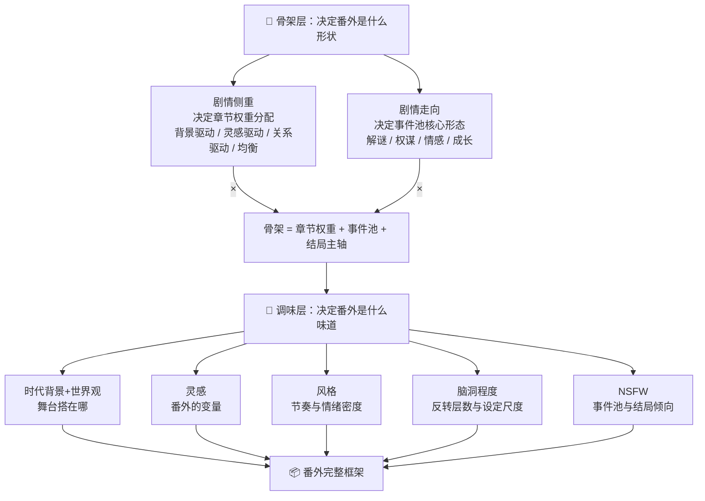
```mermaid
flowchart TD
    A["🦴 骨架层：决定番外是什么形状"]
    B["剧情侧重\n决定章节权重分配\n背景驱动 / 灵感驱动 / 关系驱动 / 均衡"]
    C["剧情走向\n决定事件池核心形态\n解谜 / 权谋 / 情感 / 成长"]
    D["骨架 = 章节权重 + 事件池 + 结局主轴"]
    E["🧂 调味层：决定番外是什么味道"]
    F["时代背景+世界观\n舞台搭在哪"]
    G["灵感\n番外的变量"]
    H["风格\n节奏与情绪密度"]
    I["脑洞程度\n反转层数与设定尺度"]
    J["NSFW\n事件池与结局倾向"]
    K["📦 番外完整框架"]

    A --> B
    A --> C
    B -- "×" --> D
    C -- "×" --> D
    D --> E
    E --> F & G & H & I & J
    F & G & H & I & J --> K
```

上方的速查图展示了最关键的框架逻辑——参数分为两层，各有职责。

**骨架层：决定番外是什么形状**

两个正交维度叠加构成骨架：

- **剧情侧重** 决定哪些章节被加权展开。背景驱动时，世界背景和情境场是核心；灵感驱动时，灵感机制展开曲线是核心；关系驱动时，角色信息和互动模式是核心。同一套灵感，侧重不同，篇幅分配完全不同。
- **剧情走向** 决定动态事件池里核心事件的形态和爆点类型。解谜探索走信息揭示链，权谋争夺走博弈态势变化，情感联结走关系节拍积累，成长蜕变走试炼-挫败-突破曲线。走向同时决定结局分支的达成主轴。

两个维度先各自定位，再叠加出最终骨架。先选侧重（哪些章节重），再选走向（事件怎么流动）。

**调味层：决定番外是什么味道**

- **时代背景 + 世界观组合** 决定"舞台搭在哪"，影响场景标志物、角色身份坐标和规则容器。同一个灵感（比如花吐症）放在现代都市和明清宅门，写出来的细节完全不同。
- **灵感** 决定事件池里是否有机制专属事件，以及机制如何与关系碰撞。没有灵感时世界正常运转；有灵感时，机制本身就是番外的张力来源。
- **风格** 决定节奏快慢、情绪密度和允许的尺度上限。甜宠糖点密集，虐心情绪累积后爆发，沙雕跳脱梗密——同一组事件在不同风格下，写法和节奏完全不同。
- **脑洞程度** 决定反转层数和设定叠加的大胆程度。低脑洞反转合理可推导；中脑洞有戏剧性但不离谱；高脑洞允许打破第四墙、规则颠覆、多灵感叠加、荒诞超现实。
- **NSFW** 开启后，事件池可从 NSFW 灵感库抽取，任务可包含亲密度推进，结局分支中至少出现一个亲密向结局。关闭时，亲密场景以氛围烘托替代直接描写。

此外，MODULE 2 还定义了以下参数的解读规则：

- **世界观 × 时间线组合模式**：当前世界/当前时间 = 日常番外；当前世界/非当前时间 = 穿越番外；非当前世界/参考当前设定 = AU同人；非当前世界/完全新世界 = 快穿番外。每种模式对世界背景章节的展开深度有不同要求。
- **系统 / 任务设计规则**：有系统有任务时需生成完整系统章节和任务清单（含主线/支线/隐藏/难度分级）；无任务时改为隐性推进机制，以推进信号替代任务下发。任务数量随尺度级别变化。
- **联动模式**：开启时强制生成 [联动锚点] 章节，包含前序番外、前序结局采用、衔接方式、继承要素清单（至少3条，含至少1条未解伏笔和至少1条关系升级/降级）。关闭时该章节完全不输出。
- **参数填写模式**：随机（AI 自由抽取）/ 抽取（严格从选项中随机）/ 固定（AI 不增不减不替换）。
- **语言选项**：不加密 = 全中文；加密 = 西班牙语输出，关键人名/地名/系统名保留中文。

### 修改建议

MODULE 2 与 MODULE 1 的素材库和 MODULE 3 的输出模板强绑定，是最牵一发动全身的模块。

- 想调整某种剧情侧重的章节权重分配 → 修改对应侧重的「呈现方式」段落
- 想加新的剧情走向类型 → 同步修改「剧情走向」定义和 MODULE 3 的动态事件池走向核心事件/爆点格式
- 想修改任务数量规则 → 修改「系统 / 任务设计指南」中各尺度的数量说明
- **建议先完整跑几个番外再改，改之前备份原始 Prompt。**

---

## MODULE 3 · 主体框架生成指令（看到的番外大纲）

番外输出内容包含：

```
[基础信息]         番外名称 / 标签 / 类型 / 时间线 / 灵感 / 风格 / 尺度
[主线介绍]         起点→转折→结局条件，150字左右
[世界背景]         （当前世界观跳过；非当前世界观完整展开）
[情境场设定]       开场快照 / 初始张力 / 张力自驱机制 / 角色待机画面
[动态事件池]       灵感-背景事件 / 走向核心事件 / 反转事件 / 走向核心爆点
[{{user}}身份信息] 番外身份 / 能力局限 / 记忆状态
[互动角色信息]     番外身份 / 走向功能 / 隐藏侧面 / 核心互动模式
[NPC/功能角色]    代称 / 登场时机 / 立场筹码
[关键场景/地点]   场景功能 / 情绪基调 / 剧情锚点
[关键道具/物件]   功能象征 / 走向意义
[系统设定]         （有系统时生成）
[任务清单]         （有任务时生成）
[隐性推进机制]     （无任务时生成，以推进信号替代任务）
[其他特殊设定]    礼仪称谓 / 特殊体系规则 / 角色OOC边界
[结局分支]         HE/BE/NE/TE/开放，含离开方式与余韵留痕
[联动锚点]         （联动模式开启时强制生成）
```

### 关键设计点

- **动态事件池的核心逻辑**：事件是素材库，不规定发生顺序，AI 根据 {{user}} 实际行为选择激活。走向核心事件是柴火（渐进积累），走向核心爆点是火花（瞬间引爆），两者不重合。
- **张力自驱机制**：保证 {{user}} 不主动推进时情境仍然有压力，靠时间倒计时 / NPC 自主推进 / 环境恶化 / 规则收紧等施压，而非靠 {{user}} 的主动行为。
- **结局达成主轴**：不同走向使用不同主轴——解谜走向以真相掌握程度为主轴，权谋走向以筹码积累为主轴，情感走向以亲密度变化为主轴，成长走向以蜕变程度为主轴。情感亲密度只在情感联结走向下作为主轴，其余走向中降为副线。
- **联动锚点的强制性**：联动模式开启时，[联动锚点] 是必须生成的章节，信息不足时 AI 须根据已有信息自行推断，不允许以任何理由跳过。

### 修改建议

- 想在大纲中增加新的分析维度（比如"角色关系图谱"） → 在 MODULE 3 对应位置增加新章节，同时在 MODULE 2 的相关参数说明中注明何时生成
- 想调整某类事件池的数量上限 → 修改动态事件池「写作速查」中的总数控制说明
- 想改结局分支的格式 → 修改 [结局分支] 的表格列和写作速查
- **核心章节建议不删，可以在「写作速查」处添加风格偏好微调。**
- **欢迎分享你做的好模板！**

---

## MODULE 4 · 输出约束（别乱改！）

这里非常重要：

```
<spinoff> ... </spinoff>
<spinoff_info> ... </spinoff_info>
```

- 生成器会解析 `<spinoff>` 为番外完整框架正文
- `<spinoff_info>` 为简要摘要，固定中文，与加密选项无关
- 简要摘要包含：番外名称 / 时空定位 / 剧情框架 / 灵感 / 风格 / 尺度 / 主导维度说明 / NSFW / 互动角色 / 联动模式 / 开场钩子

除非你想修改「简要信息」的显示内容，否则不要动这里。标签结构一旦改变，脚本解析会出错。
---

# ❓ 常见问题

### Q1：推荐用什么模型？
* **gemini 2.5 pro**（最推荐，最稳定，联动模式也扛得住）
* gemini 3.1 pro（可以试试，效果接近）
* **不建议使用 flash 系列**：本次提示词结构较案件推演台更复杂，token 量也更大，flash 模型容易出现结构遵循不稳定 / 模块丢失的情况

### Q2：NSFW 开启后内容没变化？
* 请确认破限词栏已填写，且填写的是对应角色卡 / 模型有效的破限词
* 破限词留空时开关不会生效

### Q3：AI 主线识别不准确？
* 主线识别依赖最近聊天记录，内容越丰富识别越准
* 如果主线剧情还很短，建议先不开启该功能，手动填写背景说明即可

### Q4：联动模式需要先有番外世界书吗？
* 是的，联动模式会从世界书读取已有番外大纲，所以**第一个番外请先关闭联动**，正常生成并注入世界书后，后续番外再开启联动

### Q5：选项太多不知道怎么选？
* 无脑点"随机"！每个分类都有随机选项，随机出来的组合往往比精心挑选的更有惊喜感

### Q6：没有按钮 / 按钮打不开？
* 请在社区给我看报错，最好用电脑端，F12 开发者模式给我看 error
* 也可以先问 AI，本人代码能力也是一坨 😅

---

# 📝 更新日志

## v1.2.0
* 新增：世界书条目修正模式，支持选择已有条目并生成修正版内容
* 新增：生成结果页重新生成按钮，复用上次配置与提示词再次生成

## v1.1.4
* 优化：UI选项文案、配色与提示

## v1.1.3
* 优化：优化提示词，新增“剧情走向”
* 新增：状态栏模块
* 新增：可复制提示词等小功能

## v1.0.0
* 首个发布版本
* 支持基础番外框架生成 + 事件池 + 多维走向

---

# 🧭 全系列导航

* 目前已完成了较为完整的三部曲制作——从最初想要做一个副本大纲生成器，到呼声比较高的案件生成，最后完成了自由度最高的番外生成。
* 在此感谢大家的帮助和支持，如果喜欢当前作品，欢迎看看其他两个小工具：

---

## 💀 无限流·副本生成器

> 从副本设计师的角度出发，生成有关副本的设计大纲，帮助 AI 在恐怖 / 无限流 / 跑团场景中有规则可遵循、有机制可推进、有真相可收束。

🔗 [gloria-yin/DUNGEON\_ARCHITECT](https://github.com/gloria-yin/DUNGEON_ARCHITECT)

**用于：** 恐怖故事 / 无限流跑团 / 副本任务设计 / 大世界嵌套副本 / 快穿多世界切换

**生成内容：** 世界结构 / 规则系统 / 信息不对称设计 / 反转与张力埋点

---

## ⚖️ 案件推演台·MYSTERY ENGINE

> 从案件设计的角度出发，生成完整的案件流程骨架，帮助 AI 维持动机-手法-机会三锁、不漏线索、不崩真相、反转只埋不触发。

🔗 [gloria-yin/MYSTERY\_ENGINE](https://github.com/gloria-yin/MYSTERY_ENGINE)

**用于：** 推理案件跑团 / 侦探剧情 RP / 本格·社会派·硬核·反转风格 / 多案关联·跨案元谜题 / 快穿单元案件

**生成内容：** 案件世界观 / 人物图谱 / 双轨时间线 / 线索库 + 核心突破线索链 / 真相还原 + 多结局框架 / 嵌套模式跨案结构

---

# ⭐ 最后

主线是宿命的纠缠，而番外是千万种可能的相逢。
希望织梦阁能帮你和 char 探索每一种"如果"。
